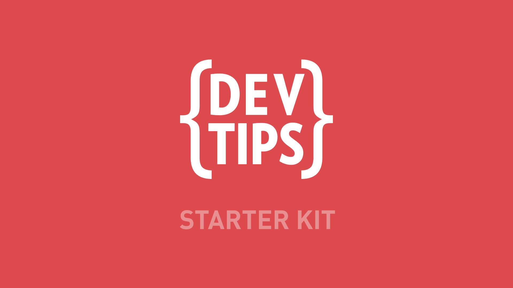

DevTips-Starter-Kit
===================

Use this as a simple structure for a simple start to a simple site.

- There is a Jekyll friendly version <a href="https://github.com/DevTips/DevTips-Starter-Kit/tree/Jekyll-Starter-Kit">here.</a>

<a href="http://www.youtube.com/watch?feature=player_embedded&v=GTBaQ2DcGUk
" target="_blank">
Watch the video on YouTube

</a>
